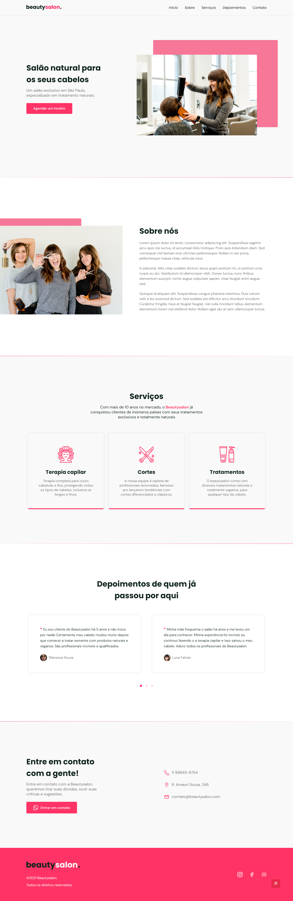

# BEAUTY SALON LANDING PAGE

## Tabela de Conteúdos

* [Visão Geral](#visao-geral)
  * [O Projeto](#o-projeto)
  * [Screenshot](#screenshot)
  * [Links](#links)
* [Tecnologias](#tecnologias)
* [Pré-requisitos](#pré-requisitos)
* [Instalação](#instalação)
* [Autor](#autor)
* [Licença](#licença)

## Visão Geral
### O Projeto
O Beauty Salon Landing Page foi um projeto desenvolvido durante o evento #NLW6 proposto pela [Rocketseat](https://www.rocketseat.com.br/).

### Screenshot

#### Desktop

#### Mobile

### Links

- Live Site URL: [Demo](https://beautysalonapp.netlify.app/)

## Tecnologias
Essas foram as tecnologias e livrarias utilizadas para a construção do projeto:
- [React](https://pt-br.reactjs.org/) - Versão 18.2.0
- [Gatsby](https://www.gatsbyjs.com/) - Versão 5.6.0
- [Emotion](https://emotion.sh/docs/introduction) - Versão 11.10.5
- [AOS](https://michalsnik.github.io/aos/) - Versão 2.3.4
- [Styled-icons](https://github.com/styled-icons/styled-icons) - Versão 10.47.0

## Pré-requisitos
Para obter uma cópia do projeto funcionando localmente, siga as instruções abaixo:

- npm
~~~javascript
npm install -g npm
~~~

- Gatsby
~~~javascript
npm install -g gatsby-cli
~~~

## Instalação
Após configurar o Gatsby em sua máquina, siga as instruções abaixo para executar a aplicação localmente:

1. Clone o repositório.
~~~git
git clone https://github.com/Makson19/beautysalon-landing-page.git
~~~

2. Acesse a pasta do projeto.
~~~
cd beautysalon-landing-page
~~~

3. Instale as dependências do projeto.
~~~javascript
npm install

ou

yarn install
~~~

4. Execute a aplicação.
~~~javascript
gatsby develop
~~~

## Autor

- Codepen - [@Makson19](https://codepen.io/Makson19)
- Frontend Mentor - [@Makson19](https://www.frontendmentor.io/profile/Makson19)
- Github - [Makson19](https://github.com/Makson19)
- LinkedIn - [Makson Douglas](https://www.linkedin.com/in/maksondouglas)

## Licensa
[BSD](./LICENSE)
